# 🏥 Hospital API

API REST desenvolvida com **Spring Boot** para gerenciamento de **médicos, pacientes e agendamentos médicos**.

O sistema permite realizar o controle de consultas, cadastrar médicos e pacientes, além de consultar agendamentos por diferentes critérios.

Este projeto foi desenvolvido com o objetivo de **praticar conceitos de backend com Java e Spring Boot**, aplicando arquitetura em camadas, DTOs, tratamento de exceções e boas práticas de API REST.

---

# 🚀 Tecnologias Utilizadas

- Java 17
- Spring Boot
- Spring Web
- Spring Data JPA
- Hibernate
- PostgreSQL
- Maven
- Lombok
- Postman (para testes da API)

---

# 🎯 Objetivo do Projeto

Este projeto foi desenvolvido para consolidar conhecimentos em:

- Desenvolvimento de **API REST**
- **Spring Boot**
- **Arquitetura em camadas**
- **DTOs para transferência de dados**
- **Spring Data JPA**
- **Validação de regras de negócio**
- **Manipulação de datas com LocalDate e LocalDateTime**

---

# 🧱 Arquitetura do Projeto

O projeto segue o padrão de **arquitetura em camadas**, separando responsabilidades:

- **Controller** – responsável por expor os endpoints da API
- **Service** – contém as regras de negócio
- **Repository** – comunicação com o banco de dados utilizando JPA
- **Model** – entidades do sistema
- **DTO** – objetos de transferência de dados
- **Exception** – exceções personalizadas
- **Util** – classes utilitárias utilizadas no projeto
- **Enums** – tipos enumerados utilizados nas entidades

---

# 📂 Estrutura do Projeto
src/main/java/com/gabrielli/hospital_api

controller
service
repository
model
DTO
exception
util
enums

# 📌 Endpoints da API

## 👨‍⚕️ Médicos

| Método | Endpoint | Descrição |
|------|---------|----------|
| POST | `/medicos` | Cadastrar médico |
| GET | `/medicos` | Listar médicos |
| GET | `/medicos/{id}` | Buscar médico por ID |
| DELETE | `/medicos/{id}` | Remover médico |

---

## 🧑 Pacientes

| Método | Endpoint | Descrição |
|------|---------|----------|
| POST | `/pacientes` | Cadastrar paciente |
| GET | `/pacientes` | Listar pacientes |
| GET | `/pacientes/{id}` | Buscar paciente por ID |
| PUT | `/pacientes/{id}` | Atualizar paciente |
| DELETE | `/pacientes/{id}` | Remover paciente |

---

## 📅 Agendamentos

| Método | Endpoint               | Descrição                     |
|------|------------------------|-------------------------------|
| POST | `/agendamentos`        | Criar agendamento             |
| GET | `/agendamentos/status` | Buscar agendamento por status |
| GET | `/agendamentos`        | Listar agendamentos           |
| PUT | `/agendamentos/{id}`   | Atualizar agendamento         |
| DELETE | `/agendamentos/{id}`   | Deletar agendamento           |

### 🔎 Buscas adicionais

| Método | Endpoint                           | Descrição                                     |
|------|------------------------------------|-----------------------------------------------|
| GET | `/agendamentos/data`               | Buscar agendamentos por data                  |
| GET | `/agendamentos/medico-data-status` | Buscar agendamentos por médico, data e status |
| GET | `/agendamentos/medico-data`        | Buscar agendamentos por médico e data         |

---

# 🔄 Uso de DTOs

Para evitar expor diretamente as entidades da aplicação, foram utilizados **DTOs**:

- `AgendamentoRequestDTO`
- `AgendamentoResponseDTO`
- `AgendamentoUpdateDTO`
- `PacienteRequestDTO`
- `PacienteResponseDTO`
- `PacienteUpdateDTO`
- `MedicoRequestDTO`
- `MedicoResponseDTO`

Os DTOs ajudam a:

- controlar os dados enviados pelo cliente
- proteger as entidades da aplicação
- facilitar a manutenção da API

---

# ⚠️ Tratamento de Exceções

A API possui **exceções customizadas** para melhorar o retorno de erros:

- **IdNotExistException** – quando um registro não é encontrado
- **DadodInvalidoException** – quando o dado informado é inválido

---

# 🧪 Testes da API (Postman)

Os endpoints foram testados utilizando **Postman**, garantindo o correto funcionamento da API.

### ➕ Cadastrar Medico
[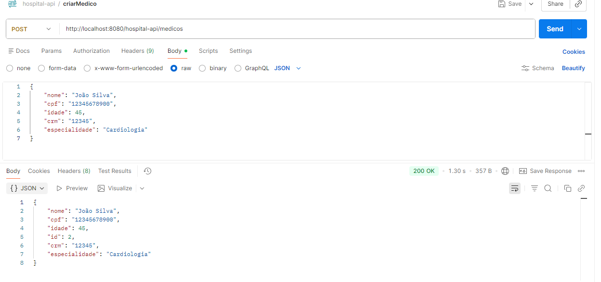](postman_testes/criarMedico.png)

### ➕ Cadastrar Paciente
[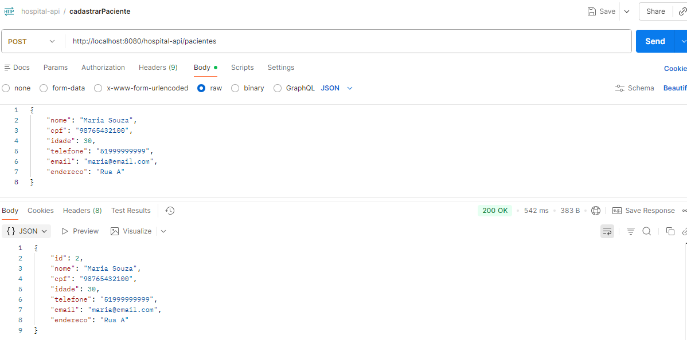](postman_testes/cadastrarPaciente.png)

### 🔎 Buscar Medico pelo id
[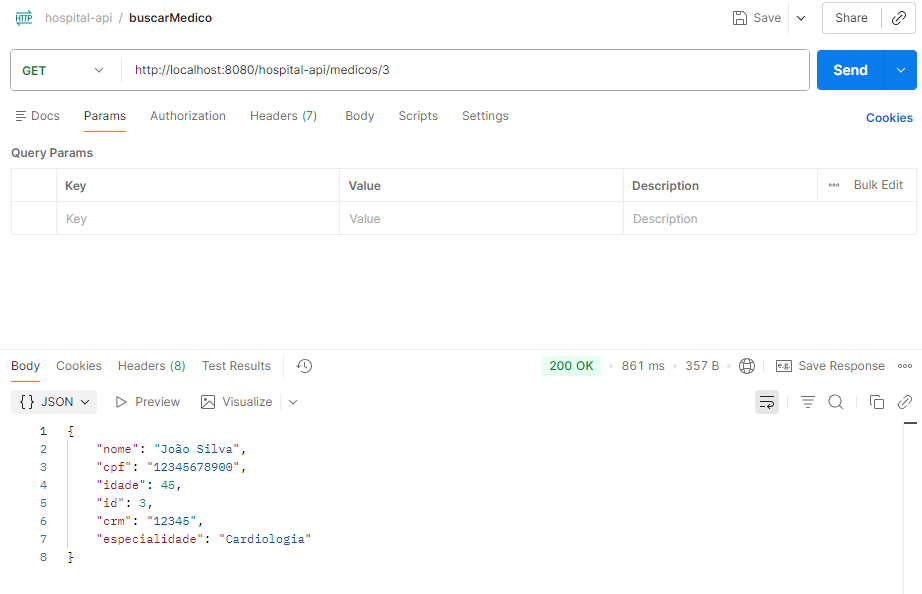](postman_testes/buscarMedico.png)

### 🔎 Buscar Paciente pelo id
[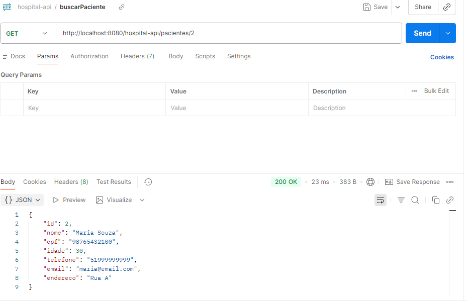](postman_testes/buscarPaciente.png)

### 📄 Listar Pacientes
[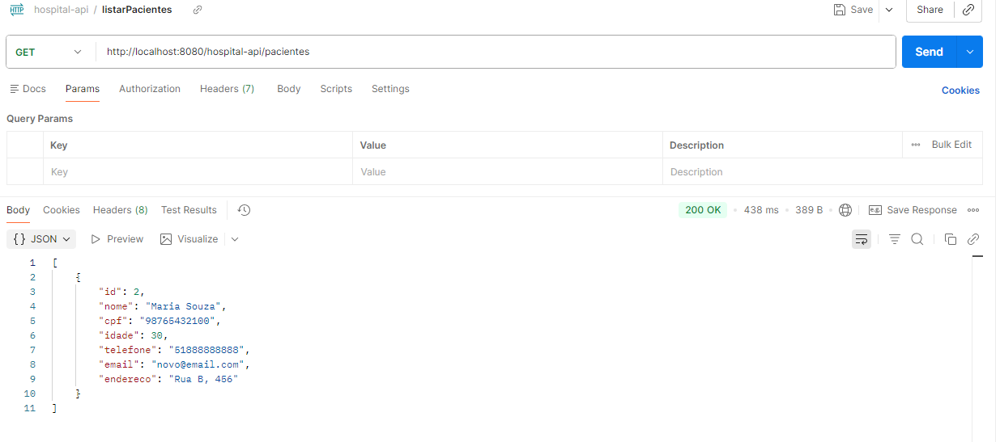](postman_testes/listarPacientes.png)

### 📄 Listar Medicos
[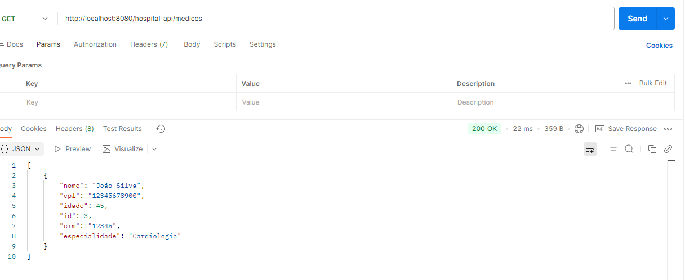](postman_testes/listarMedicos.png)

### ➕ Criar agendamento
[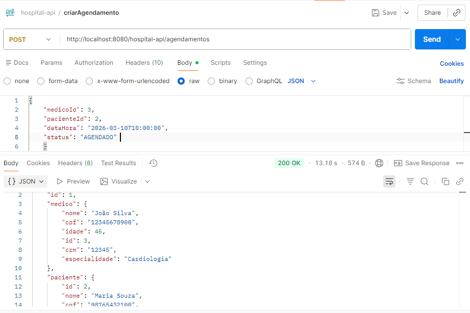](postman_testes/criarAgendamento.png)

### 🔄 Atualizar Paciente
[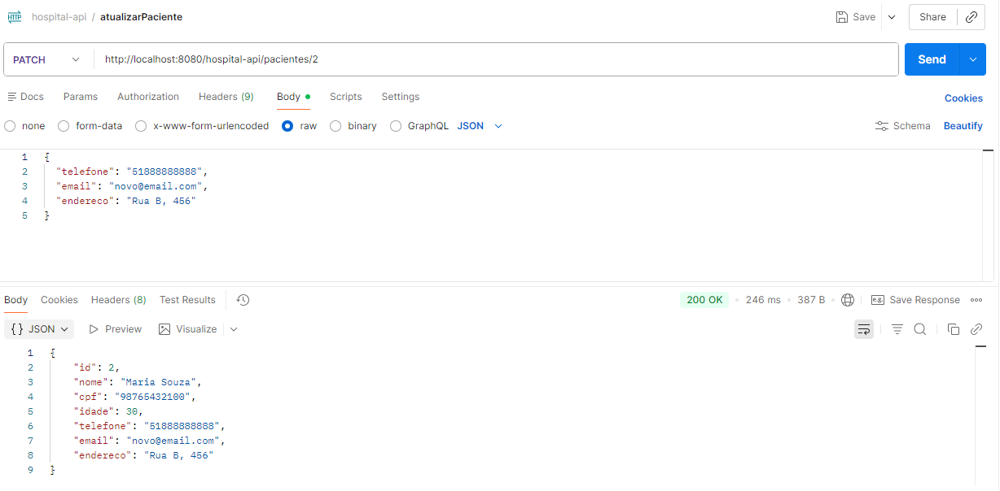](postman_testes/atualizarPaciente.png)

### 🔄 Atualizar Agendamento
[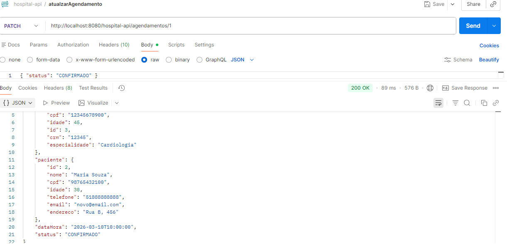](postman_testes/atualizarAgendamento.png)

### 🔎 Buscar Agendamento por status
[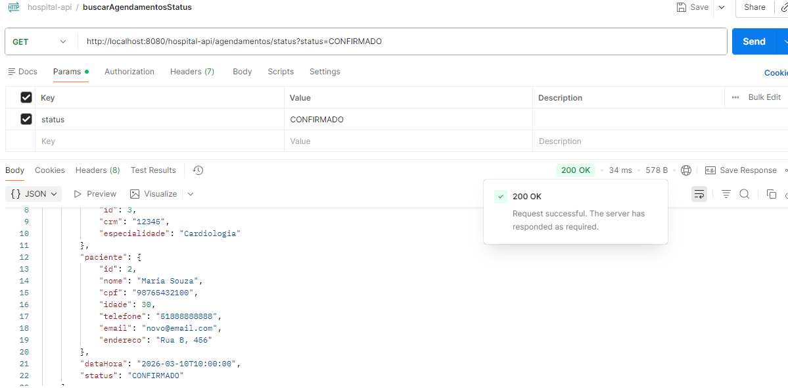](postman_testes/buscarAgendamentoStatus.png)

### 🔎 Buscar Agendamento por medico, status e data
[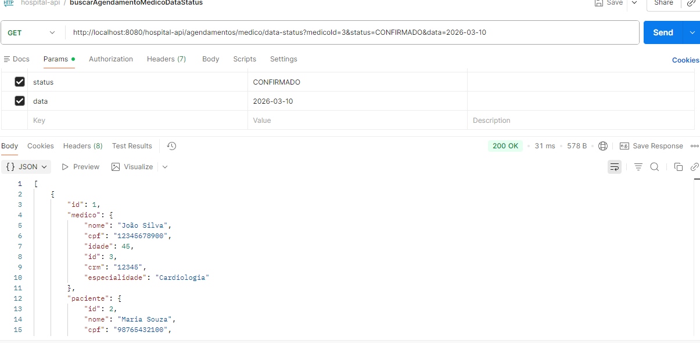](postman_testes/buscarAgendamentoMedicoStatusData.png)

### 🔎 Buscar Agendamento por data
[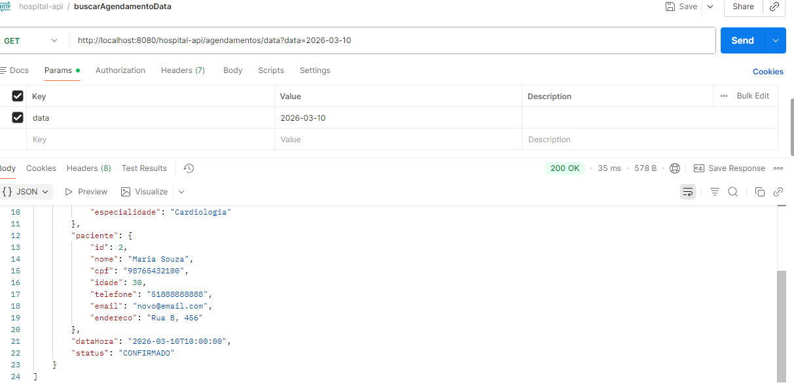](postman_testes/buscarAgendamentoData.png)

### 🔎 Buscar Agendamento por medico e data
[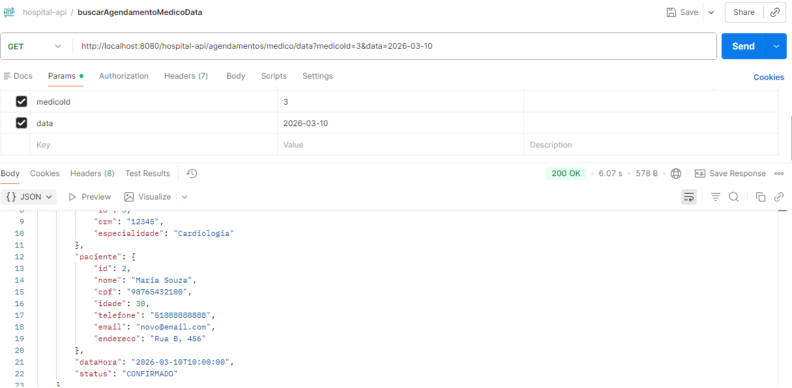](postman_testes/buscarAgendamentoMedicoData.png)


### 🔮 Futuras Melhorias

Algumas melhorias planejadas para o projeto:

Criação de interface web (frontend) utilizando React + TypeScript

Implementação de autenticação e autorização

Melhorias nas validações da API

Implementação de testes automatizados

## ▶️ Como Executar o Projeto
1. Clone o repositório:
```bash
git clone https://github.com/Gabrielli-B/hospital-api